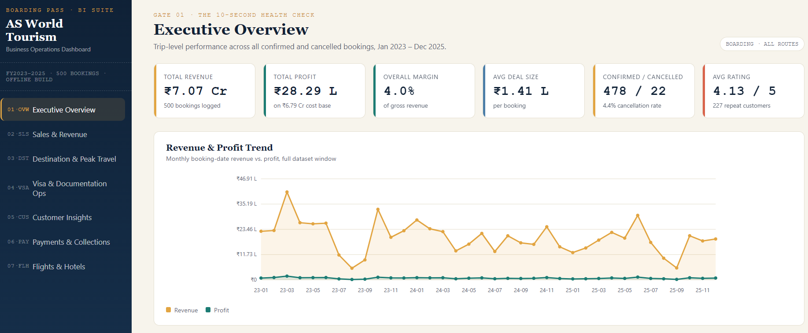
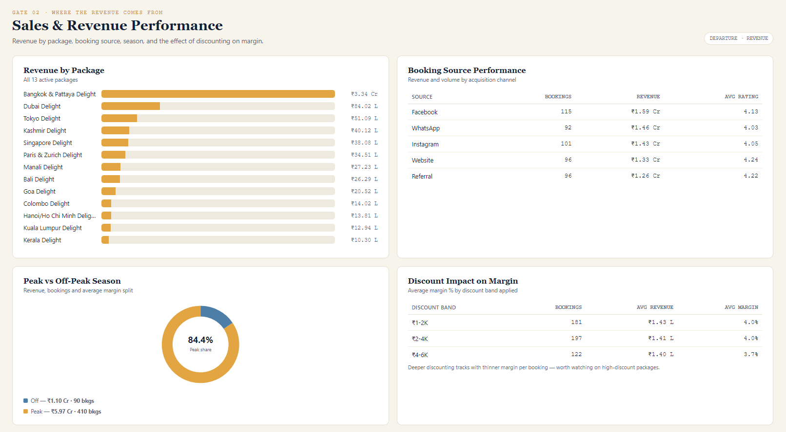
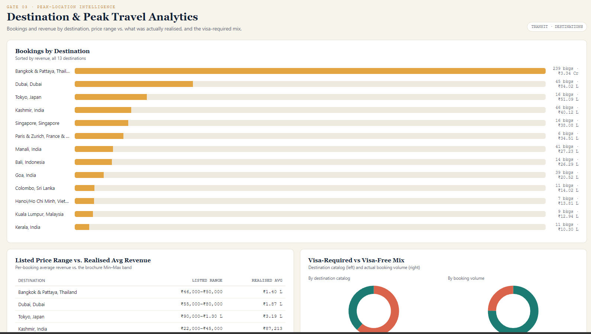
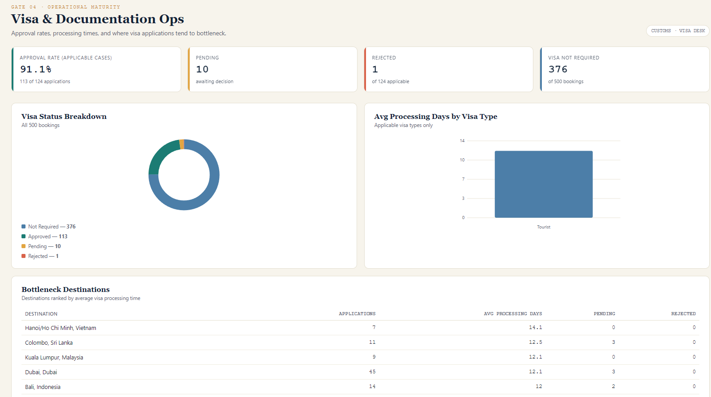
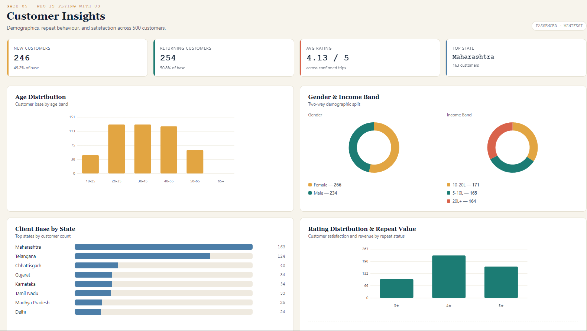
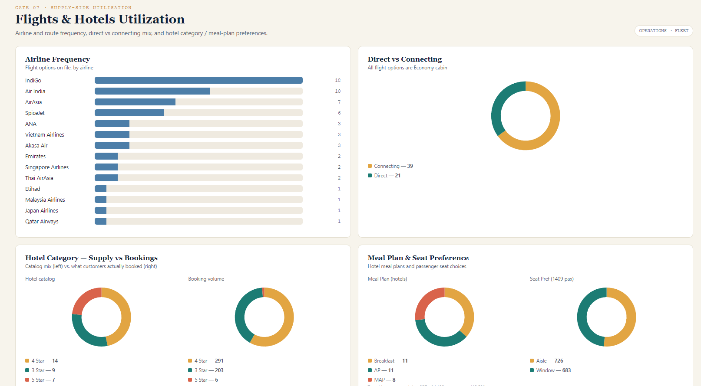

# AS World Tourism — Business Intelligence Suite

A 7-page offline BI dashboard built from `AS_WORLD_TOURISM_Dataset.xlsx`. No build step, no server, no internet connection, no dependencies — open `index.html` in any browser and it works.

# ✈️ Travel Operations Analytics Platform

[](https://JARVISROCKZ.github.io/travel-business-intelligence-dashboard/)

[](https://github.com/YOUR_USERNAME/travel-business-intelligence-dashboard)

[](LICENSE)

[](https://github.com/YOUR_USERNAME/travel-business-intelligence-dashboard)


# 📸 Dashboard Preview

## 🏠 Executive Overview



---

## 💰 Sales & Revenue Performance



---

## 🌍 Destination & Peak Travel Analytics



---

## 🛂 Visa & Documentation Operations



---

## 👥 Customer Insights



---

## ✈️ Flights & Hotels Utilization




## Files

```
index.html      Page shell — sidebar nav + empty page containers
style.css       All styling (design tokens, layout, chart CSS)
app.js          Chart engine (hand-rolled SVG bar/line/donut — no charting library)
                + the 7 page renderers + navigation logic
data.js         Pre-aggregated data, extracted from the workbook (as RAW_DATA)
assets/         favicon.svg
README.md       This file
LICENSE         Usage terms
```

## How it works

`data.js` defines `const RAW_DATA = {...}` — every number on every page (KPIs, chart
series, table rows) was computed once from the source workbook with pandas and baked
into this file. `app.js` reads `RAW_DATA`, renders each of the 7 pages into the DOM, and
draws every chart as inline SVG generated on the fly — no Chart.js, no CDN, no fonts
loaded from the web. That's what makes it work with the browser fully offline.

## Pages

1. **Executive Overview** — revenue, profit, margin, booking trend, top destinations
2. **Sales & Revenue Performance** — by package, booking source, season, discount impact
3. **Destination & Peak Travel Analytics** — bookings by destination, listed vs. realised price, visa mix
4. **Visa & Documentation Ops** — approval rate, processing days, bottleneck destinations
5. **Customer Insights** — new vs returning, demographics, ratings
6. **Payments & Collections** — payment mode, status, advance/balance, installments
7. **Flights & Hotels Utilization** — airline frequency, cabin/route mix, hotel & meal preferences

## Updating the data

This build is a static snapshot. To refresh it after the source workbook changes,
re-run the aggregation step against the new `.xlsx` and regenerate `data.js` (the
`RAW_DATA` object) — `app.js` and `index.html` don't need to change unless you're
adding a new chart or page.

## Note on scope

The source workbook's `Company_Summary` sheet states this is a single-proprietor
operation with no separate sales/operations staff on record, so no "sales exec
leaderboard" is included — booking-source performance is used in its place.

## Browser support

Any modern browser (Chrome, Edge, Firefox, Safari). No Internet Explorer support —
the SVG chart engine uses standard ES6 (arrow functions, template literals).

